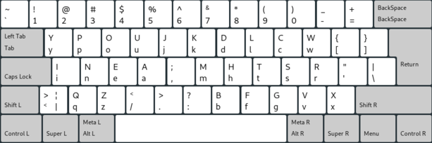

# MTGAP

Having tried different keyboard layouts lately, namely

- QWERTY,
- Colemak,
- Dvorak,
- Colemak-DH,

I kept looking for alternatives and reading in a couple of forums.

One layout that managed to do well, or rather, stand out, in all the different keyboard layout analyzers I tried is the [latest version of MTGAP's layout](https://mathematicalmulticore.wordpress.com/the-keyboard-layout-project/).
I am currently using the version that optimizes the 30 main keys on a standard (ISO or ANSI) keyboard, and I'm very impressed. It is a roll-heavy layout with a good amount of alternation and feels extremely smooth overall.

Since I am currently using macOS, Windows 10, Arch Linux and Debian simultaneously, I implemented the 30-key version of MTGAP for those systems.

## Installation

### Linux

If you use X, do

    sudo cp xkb/mtgap_30 /usr/share/X11/xkb/symbols/

To make the layout visible to GNOME, add the contents of `xkb/evdev_section.xml` to

    /usr/share/X11/xkb/rules/evdev.xml

(But be aware that system updates can overwrite `evdev.xml`. Then you have to manually insert the section again.)

The linux version contains the following variants:

- `basic`
- `german` (`basic` plus German umlauts, `ß`, and `ẞ`)
- `caps_bksp` (CAPS as backspace)
- `german_caps_bksp` (`german` with CAPS as backspace)

I have gotten it to work on Wayland as well, but I don't specifically remember what I did to get there. IIRC it was similar to the above plus basically telling Wayland to be xkb compatible.

### macOS

The macOS version of MTGAP was created with *Ukelele*, which can also be used to install the layout. On macOS, I also included the fully optimized variant of MTGAP for an ANSI keyboard, but do not personally use it.

### Windows

The layout was created using the ancient [Microsoft Keyboard Layout Creator](https://www.microsoft.com/en-us/download/details.aspx?id=22339). It is able to create an installer/uninstaller executable from the `*.klc` files inside the `win` directory (30-key and fully optimized versions).
